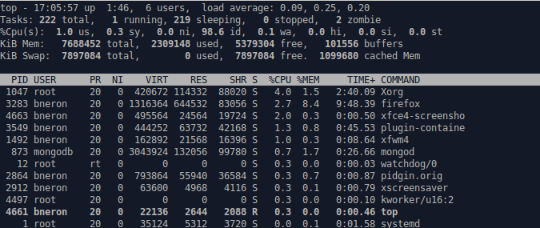
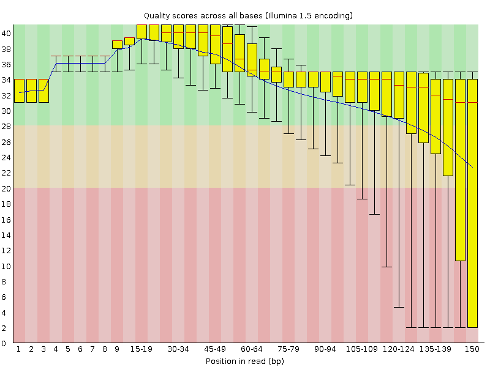
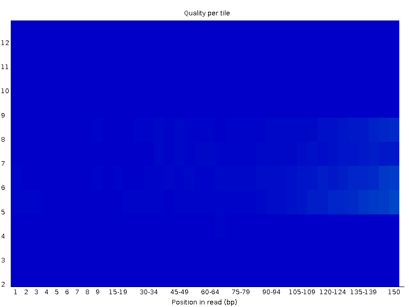

### Now let's start an analysis

* Use `top` to determine whether other resources are being run at the moment
 * Do you have enough resources for your work?



alternativley we can use htop, it's easier to read the output.
if htop is not installed on your virtual machine install it with

```
apt-get install htop
htop
``` 


### screen command usage.
- _screen_ command is basically used in order to keep your virtual machine active (running in background) even after you log out/off your machine.

All you need is to:
* type ```screen``` after when you are already connected to the cloud via SSH
* Now you are in the screen session, you can launch your software with the right parameters (see *start an analysis* section below)
* After you have successfully launched the software (here FASTQC), you can know log out by typing ```Ctrl-a d```
* At this point you can even shut down your local machine while the job you launched will still be running on the VM
* You can now connect again via SSH to the cloud and type ```screen -r```
* When you are done with your screen session just type ```exit``` to terminate the screen


### Now let's start an analysis

* We're going to run FASTQC on a single FASTQ file we downloaded previously
  * Prior to starting should we set up a work directory for this?
  * We can add this as an option to FASTQC
  * ...but where is FASTQC?
  * Is it in your PATH?

```
# CODE HERE TO ADD FASTQC TO PATH?
fastqc <PATH TO FOO.FASTQ> -o <WORKDIR>
```

**Note** - If they are taught (and they probably should be) the output dir should follow the same data organization standards talked about (or that will be discussed) in the data organization module.

### FASTQC Results

Note that the output is in a specific working directory, and is present at both an HTML file and a `*.zip` file

How do you open the HTML file?

```
# Remote Server
# where is your data?
pwd
```

```
# Your laptop
scp <REMOTE_URL:location of HTML file> <LOCAL DIRECTORY>
```

Open the file:

```
<FASTQC example?>
```

### Interpret FASTQC results

Let's have a look at the results.



This is the boxplot analysis for your FASTQ data. Phred quality score is on the ordinate axis.  The purpose of this plot is to look at the overall quality of the seuqence



This is a tile plot for your FASTQ data. The purpose of this plot is to determine whether problems were encountered during sequencing

```
<AMAZING OTHER STUFF>
```

### Possible Quality Issues

Some problems you might encounter.  A nice summary of issues can be found at:

* [Good sequence run](http://www.bioinformatics.babraham.ac.uk/projects/fastqc/good_sequence_short_fastqc.html)
* [Bad sequence run](http://www.bioinformatics.babraham.ac.uk/projects/fastqc/bad_sequence_fastqc.html)
* [RNA-Seq](http://www.bioinformatics.babraham.ac.uk/projects/fastqc/RNA-Seq_fastqc.html)
* [Small RNA](http://www.bioinformatics.babraham.ac.uk/projects/fastqc/small_rna_fastqc.html)

The last two are examples where failing tests do not mean the sample is bad (depends on the technology, experiment, etc)

*Question* : Are any Illumina adapters present in your data?

### Analysis complete (?)

Wait, you have other files to analyze.  Can you do this in a better way?

